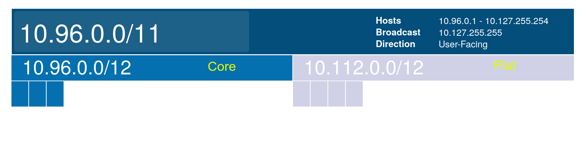

# VPC Allocation

All VPC addresses will be in the `10.96.0.0/11` CIDR. This block will be subdivided by tenant.

All accounts will have a `/16` CIDR reserved.

[this diagram below created using tidalmigrations subnet builder](https://tidalmigrations.com/subnet-builder/)

| **Network Address** | **CIDR** | **Name** | **Region** | **Broadcast Address** |
| ------------------- | -------- | -------- | ---------- | --------------------- |
| 10.96.0.0           | 12       | Core     |            | 10.111.255.255        |
| 10.112.0.0          | 12       | Plat     |            | 10.127.255.255        |

## Core Accounts

| **Network Address** | **CIDR** | **Name** | **Region** | **Broadcast Address** |
| ------------------- | -------- | -------- | ---------- | --------------------- |
| 10.96.0.0           | 16       | network  | ue2        | 10.96.255.255         |
| 10.97.0.0           | 16       | auto     | ue2        | 10.97.255.255         |
| 10.98.0.0           | 16       | corp     | ue2        | 10.98.255.255         |
| 10.99.0.0           | 16       | analytics| ue2        | 10.98.255.255         |

## Plat Accounts

| **Network Address** | **CIDR** | **Name** | **Region** | **Broadcast Address** |
| ------------------- | -------- | -------- | ---------- | --------------------- |
| 10.112.0.0          | 16       | dev      | ue2        | 10.112.255.255        |
| 10.113.0.0          | 16       | staging  | ue2        | 10.113.255.255        |
| 10.114.0.0          | 16       | prod     | ue2        | 10.114.255.255        |
| 10.115.0.0          | 16       | sandbox  | ue2        | 10.115.255.255        |
